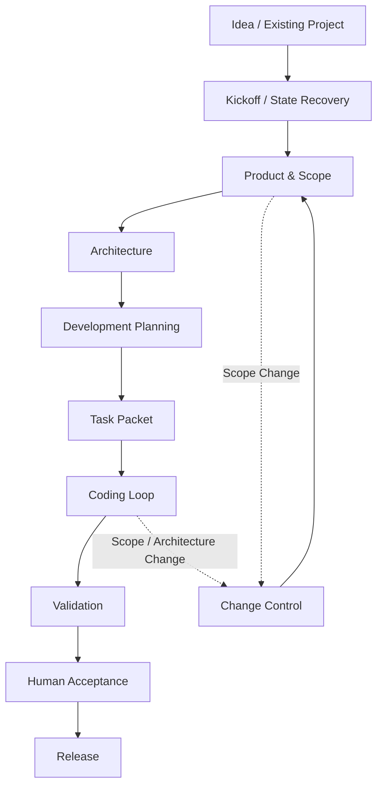

# project-guide

`project-guide` 是一个面向 **Agent Coding / Vibe Coding** 的项目规划与项目治理 Skill。

它让 AI 以“项目领航员”身份工作：从一句想法开始，主动完成立项、产品设计、架构、开发规划、Task Packet、实现、验证、人工验收、发布与变更管理；用户保留目标、关键取舍、真实体验和外部授权。

它不是单纯的 planning prompt。核心目标是让 Agent 在真实项目中知道：**下一步该做什么、做到什么程度、什么证据才算完成、什么时候必须停下来重新决策。**

## 为什么需要它

直接把项目交给 Coding Agent，常见问题包括：

- 需求还没定清楚就开始写代码；
- 小改动走得过重，大改动又缺少正式的范围控制；
- 状态文档、实际文件和 Git 工作区彼此漂移；
- 自动测试通过就被误判成“已经验收、可以上线”；
- 新需求被顺手塞进当前任务，Scope 越做越大；
- 跨会话后不知道该相信哪份记录；
- 未经明确授权就触及部署、云资源、账号、付费或生产数据；
- 非技术用户被迫承担本应由 Agent 完成的技术判断。

`project-guide` 把这些问题转成可执行的流程规则、准出门（Gate）和证据边界。

## 核心设计原则

### 1. Adaptive Process

流程按任务的**不确定性、影响范围和可逆性**裁剪：

- 文案、样式、已定位小缺陷：目标 → 最小修改 → 对应检查 → diff 审查；
- 已有项目的明确功能：引用现有基线 → Task Packet → 实现与验证；
- 新项目或重大边界变化：Brief → 产品设计 → 架构 → 里程碑 → Task Packet；
- 关键能力未知：先做有限 Spike，用证据决定是否继续。
### 2. Single Source of Truth

每类信息只维护一个当前来源：

- 产品目标与范围 → `docs/PROJECT.md` 的 Brief；
- 系统边界 → 架构基线；
- 重要取舍 → 关键决定 / ADR；
- 当前工作状态 → `docs/PROJECT.md` 当前任务；
- 代码变化 → Git；
- 技术验证 → 测试与可复跑证据；
- 真实体验 → Human Acceptance。

如果状态记录与当前文件、Git 或可复跑证据冲突，以后者为准。

### 3. Evidence Before Claims

Agent 汇报时区分：

- **用户陈述**；
- **状态文件记录**；
- **本轮已验证**。

未经本轮复验的结果不能写成“已确认”。占位测试、历史状态或用户转述，也不能冒充当前验证证据。

### 4. Acceptance Is Not Tests

Unit / Integration Test、Build、Browser Test、Human Acceptance、真实部署 Smoke Test 是不同证据。

**自动测试全绿 ≠ 人工验收完成 ≠ 可以发布。**

### 5. BLOCKED Is a Valid State

关键 reference、运行入口、外部依赖、决策或授权缺失时，应明确返回 `BLOCKED`，而不是凭记忆补规则、猜测试通过或提前宣布完成。
### 6. Authority Gates

以下动作需要针对具体目标和环境的明确授权：

- 云服务与账号 / 凭据；
- 付费资源；
- 部署与公开发布；
- 生产数据读写；
- 其他会改变外部系统状态的动作。

“可以分析”不等于“可以执行”，“本地可运行”也不等于“可以操作生产环境”。

### 7. Change Control

新需求不会自动变成代码改动。Agent 先判断它是缺陷、优化、新功能，还是 Scope / Architecture 变化，再评估对用户流程、数据、接口、权限、费用、部署和迁移的影响。

如果改变已批准的架构或范围，应先更新相应基线与 Task Packet，再进入实现。

### 8. AI Leads, Human Decides

AI 负责主动查状态、整理信息、提出主推荐、形成产物、执行技术工作和验证结果；人主要负责目标、关键取舍、真实体验、外部授权与最终验收。

面向非技术用户时，尽量给**一套主推荐 + 最少必要问题 + 唯一下一步**，而不是把数据库、框架或部署细节重新甩给用户。

### 9. Optional Deep Knowledge Layer

核心 Skill 独立可用；本机如有更完整的方法论知识库，可通过未跟踪的 `project-guide.local.json` 启用深知识路由。Agent 仍先使用核心规则；深知识读取采用 **allowlist-only**：只读取当前 route 明确列出的 1–2 篇精确文件，不先枚举、搜索或递归扫描知识库，也不自动进入 `90 原始资料`、原始聊天或历史导出，更不能把历史方法论当成当前项目证据。

## 工作流程


## 仓库结构

```text
project-guide/
├── README.md
├── LICENSE
├── .gitignore
├── .gitattributes
├── skill/
│   └── project-guide/
│       ├── SKILL.md
│       ├── project-guide.local.example.json
│       ├── references/          # 核心规则 + 可选 Knowledge Router
│       └── scripts/             # 本地知识库配置校验
├── docs/
│   └── design.md
└── eval/
    ├── README.md
    ├── cases.json
    ├── rubric.md
    ├── evaluator-schema.json
    ├── run_eval.py
    └── run_graders.py
```

- `skill/`：实际可安装的 Project Guide Skill；
- `eval/`：行为评测与回归测试；
- `docs/`：面向维护者的公开设计说明。

原始研究资料、聊天记录和个人 Obsidian 知识库不属于公开发行版。

## 安装

```bash
git clone https://github.com/xymnb/project-guide.git
```

将 `skill/project-guide/` 复制到所用 Agent 客户端的 Skill 目录。例如：

```text
Windows: %USERPROFILE%\.agents\skills\project-guide
macOS / Linux: ~/.agents/skills/project-guide
```

不同客户端的 Skill 目录可能不同，请以该客户端实际约定为准。核心运行规则无需额外服务；仅可选的本地知识库校验脚本需要 Python。

## 可选：连接本地 Obsidian / Knowledge Base

公开版不会包含作者本机路径。若你有自己的深层知识库，可复制 `project-guide.local.example.json` 为 `project-guide.local.json`，设置 `knowledge_base_root` 与各阶段 `routes`。真实 local 配置被 Git 忽略，不应提交到公开仓库。

```bash
python scripts/validate_knowledge_base.py
```

启用后，Skill 先执行自身核心规则，再按当前阶段读取 route 中最多 1–2 篇文档；不会递归追 Obsidian 链接，也不会自动读取原始聊天或原始资料。配置缺失、路径失效时自动回退到核心 Skill，不因此阻塞项目。

## 使用方式

安装后可以直接用自然语言启动，例如：

- “我不懂技术，想做一个本地工具，你带我把项目做起来。”
- “继续这个项目，先检查现在处于什么阶段，再告诉我唯一下一步。”
- “这个功能应该走多深的流程？给我最小 Task Packet。”
- “测试已经通过了，现在能不能宣布验收完成？”
- “需求中途变成多人登录和云同步，先分析范围与架构影响。”

如果所用客户端支持显式 Skill 调用，也可以使用 `$project-guide`。

## 项目状态模型

对于持续开发的项目，Skill 使用 `docs/PROJECT.md` 作为跨会话锚点，核心字段包括：

- Brief；
- 暂定假设；
- 关键决定；
- 里程碑；
- 当前任务；
- 唯一下一步。

它不是新的日志系统。代码历史仍交给 Git，技术验证交给测试证据，重大架构决策可单独进入 ADR。

## Eval

`eval/` 提供 10 个端到端行为场景，覆盖：

1. 非技术用户一句话启动新项目；
2. 信息充分时直接形成 Kickoff 产物；
3. 小改动的最短流程裁剪；
4. 开发中途发生重大 Scope Change；
5. 自动测试通过但人工验收 / 部署证据不足；
6. 跨会话恢复且状态文件与 Git 工作区冲突；
7. 必要 reference 缺失时是否诚实进入 `BLOCKED`；
8. fake Knowledge Base 下的 planning 深知识路由；
9. 没有 local config 时是否正确 fallback 到核心 Skill；
10. change-control 路由是否保持隔离、不会追进 `90 原始资料`。
评测不是比较固定措辞，而是检查 Agent 是否真的表现出 Skill 规定的行为。`rubric.md` 使用 10 个维度、每项 0–2 分的 20 分制评分。

运行前提：Python 3.9+、Git、已安装并登录的 Codex CLI。

```bash
cd eval
python run_eval.py
python run_eval.py --only S03-small-change
python run_graders.py runs/<时间戳>
```

运行产物写入 `eval/runs/`，该目录被 Git 忽略，不进入公开仓库。

> 本仓库不在 README 中声明未经重新运行验证的分数。历史结果、人工检查和当前 runtime evidence 应分别记录。

详见 [`eval/README.md`](eval/README.md)。

## 设计与维护

详细设计见 [`docs/design.md`](docs/design.md)。

当前维护边界：

- 实际运行中的 Skill 是行为 Source of Truth；
- 本仓库 `skill/project-guide/` 发布与运行版一致的公开副本；
- `eval/` 是当前正式测试与回归维护位置；
- 私有 Obsidian / 原始研究资料不进入公开仓库，也不由发布流程改写；本机可通过被 Git 忽略的 local config 将其作为只读深知识层接入。

## License

[MIT License](LICENSE)
